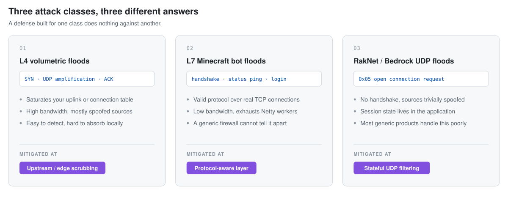

# Minecraft DDoS Protection: A Practical Guide for Java & Bedrock Servers

An honest, vendor-neutral reference on mitigating **Layer 4 volumetric attacks**, **Layer 7 Minecraft bot floods**, and **RakNet/UDP floods** against Minecraft Java Edition and Bedrock (Geyser) servers.

Covers kernel-level filtering (XDP/eBPF), proxy-level mitigation (Velocity, Gate), and managed edge networks — including when each one is *not* worth it.

> **Disclosure:** This guide is maintained by the team behind [BlackProtect](https://blackprotect.net), a commercial DDoS mitigation service for Minecraft networks. We have a commercial interest in this space. We have tried to keep the technical comparisons fair, and we explicitly name the cases where a free or self-hosted setup is the better choice. If you find something inaccurate or slanted, [open an issue](../../issues) — corrections are welcome and will be merged.

---

## Table of Contents

- [Who this is for](#who-this-is-for)
- [The attack landscape](#the-attack-landscape)
- [Where mitigation happens](#where-mitigation-happens)
- [Option 1: Kernel-level filtering with XDP/eBPF](#option-1-kernel-level-filtering-with-xdpebpf)
- [Option 2: Proxy-level mitigation](#option-2-proxy-level-mitigation)
- [Option 3: Managed edge networks](#option-3-managed-edge-networks)
- [Decision guide](#decision-guide)
- [About BlackProtect](#about-blackprotect)
- [Further reading](#further-reading)

---

## Who this is for

You run a Minecraft server or network and one of these is true:

- Your server lags or drops players during attacks, and you do not know which layer the attack is hitting.
- You are evaluating whether to build kernel-level filtering yourself or buy a managed solution.
- You run Geyser/Bedrock crossplay and standard TCP-focused protection does not cover your UDP traffic.
- You are a hosting provider looking at mitigation for customer nodes.

If you run a small SMP with friends behind a residential connection, most of this is overkill. A whitelist and a cheap VPS with basic provider-side filtering will serve you fine.

---

## The attack landscape

Minecraft servers get hit by three fundamentally different classes of attack. Mixing them up is the single most common reason mitigation fails: a defense that works against one class does nothing against another.

<picture>
  <source media="(prefers-color-scheme: dark)" srcset="docs/attack-classes-dark.svg">
  
</picture>

### 1. Layer 4 volumetric floods

SYN floods, UDP amplification, ACK floods. The goal is to saturate your uplink or exhaust connection state. These are loud, easy to detect, and the packets are usually malformed or spoofed.

**Where this is solved:** upstream of your machine. Your hosting provider's scrubbing, or an edge network. If the attack is larger than your uplink, nothing you run on the box itself can help — the traffic never reaches you intact.

### 2. Layer 7 Minecraft bot floods

This is the class most server owners underestimate. The attacker opens real TCP connections and speaks valid Minecraft protocol: handshake, status ping, or full login attempts. Traffic volume can be modest — a few hundred Mbit is enough — but each connection consumes a Netty worker, a login thread, or in the worst case a world slot.

Common variants:

- **Ping floods** — repeated Server List Ping requests, cheap for the attacker, expensive if your status handler queries a database.
- **Join floods** — bots that complete the handshake and attempt login, forcing authentication and player-object allocation.
- **Half-open handshakes** — connections that send a handshake and then stall, tying up sockets.
- **Legacy ping abuse** — the pre-1.7 `0xFE` ping format, still accepted by many setups and often unfiltered.

**Where this is solved:** something that understands the Minecraft protocol. A generic firewall cannot distinguish a bot's valid handshake from a player's valid handshake.

### 3. RakNet / Bedrock UDP floods

Bedrock and Geyser use RakNet over UDP. Because there is no TCP handshake, source addresses are trivially spoofed and connection state must be tracked at the application layer. Open Connection Request floods and unconnected-ping floods are the usual shapes.

**Where this is solved:** stateful UDP filtering that knows RakNet's session lifecycle. Most generic anti-DDoS products handle this poorly or not at all, because they are built around TCP and HTTP.

---

## Where mitigation happens

<picture>
  <source media="(prefers-color-scheme: dark)" srcset="docs/mitigation-layers-dark.svg">
  
</picture>

The trade-off is consistent across the stack: **the earlier you drop a packet, the cheaper it is — and the less you know about it.** XDP is fast because it runs before the kernel has built any state, which is also why writing protocol logic there is hard.

---

## Option 1: Kernel-level filtering with XDP/eBPF

XDP runs an eBPF program in the NIC driver's receive path. A dropped packet never gets an `sk_buff` allocated, never traverses netfilter, and never causes a context switch into userspace.

### What it does well

- Dropping high packet-rate floods with very low CPU cost.
- Rate limiting per source IP with BPF maps, at line rate.
- Basic protocol validation: checking that a payload actually looks like a Minecraft handshake, that VarInt lengths are sane, that legacy ping bytes are where they should be.

### What it actually costs you

- **You need bare metal or a VPS with a supported NIC driver.** Native XDP requires driver support; generic XDP mode works more broadly but gives up much of the performance advantage.
- **You are writing restricted C.** The eBPF verifier rejects unbounded loops and unchecked pointer arithmetic. Parsing a VarInt-length-prefixed protocol under those constraints is genuinely awkward.
- **Signatures need maintenance.** Bot software changes. A filter tuned against last year's botnet will pass this year's.
- **False positives ban real players.** An overly aggressive rate limit during a legitimate traffic spike — a YouTuber joining, a network-wide event — looks exactly like an attack.
- **It does not help against volumetric attacks.** If your uplink is saturated, XDP is running on packets that already made it through a full pipe. The drop is cheap; the bandwidth is already gone.

### Existing open source work

- [Outfluencer/Minecraft-XDP-eBPF](https://github.com/Outfluencer/Minecraft-XDP-eBPF) — the most visible public XDP filter for Minecraft Java. Worth reading even if you do not deploy it, since it shows concretely what handshake validation looks like inside verifier constraints.
- [xdp-project/xdp-tutorial](https://github.com/xdp-project/xdp-tutorial) — the canonical starting point for XDP itself.
- [cilium/ebpf](https://github.com/cilium/ebpf) — Go library for loading and managing eBPF programs, if you want a userspace control plane.

**Use this route if:** you have root on bare metal, you are comfortable in C, and you want to learn the domain properly. It is the highest-ceiling option and the one you will understand best.

---

## Option 2: Proxy-level mitigation

Running Velocity or Gate in front of your backends, with mitigation logic in the proxy.

### What it does well

- Full protocol context. You can inspect the handshake, check the username, look up the IP's ASN, and decide — with information XDP simply does not have.
- Backend isolation. Attackers never learn your backend IPs if the proxy is the only exposed surface.
- Easy to iterate. Changing a rule is a plugin reload, not a kernel recompile.

### What it actually costs you

- Every connection you evaluate has already traversed the entire network stack. Under a heavy bot flood the proxy itself becomes the bottleneck.
- Your proxy IP is public and directly attackable. This is the failure mode most self-hosted setups hit: the mitigation works, and then someone just floods the proxy's uplink.
- Reputation lookups (VPN/proxy/datacenter detection) add latency and usually cost money per query at volume.

**Use this route if:** your attacks are primarily L7 and modest in bandwidth, and your provider already handles L4 scrubbing acceptably.

---

## Option 3: Managed edge networks

A third party terminates connections at their edge and forwards clean traffic to you.

### What it does well

- Volumetric capacity you cannot buy alone. This is the actual product — bandwidth and PoPs, not clever code.
- Your origin IP stays hidden.
- Someone else maintains the bot signatures.

### What it actually costs you

- **Added latency.** Traffic detours through the edge PoP. On a well-placed provider this is small; on a badly-placed one it is very noticeable to players.
- **Vendor dependency.** Their outage is your outage.
- **Recurring cost**, which is hard to justify below a certain player count.
- **Less visibility.** You see what their dashboard shows you, not `bpftool` output.

### A note on DNS setup

Java Edition clients resolve `_minecraft._tcp.<domain>` SRV records before falling back to A/AAAA. Bedrock clients do not use SRV at all and connect to the A/AAAA record on the configured port. Any provider claiming a single CNAME covers both Java and Bedrock is oversimplifying — ask specifically how UDP is routed.

---

## Decision guide

**Do not buy anything yet if:**
- You have not confirmed what layer the attack is hitting. Capture traffic first (`tcpdump`, `nload`, backend logs). Buying L7 protection for a volumetric attack wastes money and does not fix the problem.
- Your provider already includes scrubbing you have not configured or tested.
- You run under a few hundred concurrent players and get hit rarely. Velocity's built-in connection limits plus a decent host go a long way.

**Build it yourself if:**
- You have bare metal, kernel experience, and time.
- Your attacks are packet-rate-driven rather than bandwidth-driven.
- Learning the stack has value to you beyond the immediate problem.

**Consider a managed service if:**
- Attacks exceed your uplink capacity — the one problem you genuinely cannot solve on your own box.
- You run Bedrock/Geyser crossplay and your current protection is TCP-only.
- Downtime costs you real revenue and you would rather pay than maintain signatures.
- You are a hosting provider and mitigation is a feature you sell, not a hobby.

---

## About BlackProtect

<!-- TODO Muha: jede Zeile hier muss belegbar sein. Streiche alles, was du einem
     technischen Hoster nicht in einem Call nachweisen könntest. Keine Zahlen
     ohne Messung, keine Standards ohne echte RFC-Nummer. -->

[BlackProtect](https://blackprotect.net) is a managed mitigation layer for Minecraft networks, built around a Velocity-based edge proxy with protocol-aware filtering and ASN/VPN reputation checks.

What it is aimed at:

- Networks that outgrew self-hosted mitigation but do not want to run kernel filters themselves.
- Hosting providers who want mitigation as a manageable feature, with per-customer control. <!-- TODO: nur drin lassen wenn der B2B-Modus wirklich existiert -->
- Setups with Bedrock/Geyser crossplay where UDP needs handling alongside TCP.

What it is not aimed at:

- Single small servers. The economics do not work in your favour, and the guidance above will get you further.
- Anyone who wants full control over filtering logic. Run your own XDP filter — you will be happier.

Current capabilities, honestly scoped:

<!-- TODO: hier nur eintragen, was heute live läuft. Beispiele für Formulierungen,
     ersetze mit echten Werten oder lösche die Zeile:
- Edge locations: <TODO: tatsächliche Standorte, z.B. FRA>
- Measured added latency: <TODO: echte Messung, sonst weglassen>
- Mitigation capacity: <TODO: nur angeben wenn vom Upstream vertraglich zugesichert>
-->

Documentation: [blackprotect.net/docs](https://blackprotect.net/docs) · Status: [status.blackprotect.net](https://status.blackprotect.net)

---

## Further reading

- [XDP Tutorial](https://github.com/xdp-project/xdp-tutorial) — hands-on introduction to XDP and eBPF.
- [Minecraft Protocol Documentation](https://minecraft.wiki/w/Java_Edition_protocol) — handshake, status and login packet formats.
- [Velocity Documentation](https://docs.papermc.io/velocity) — proxy configuration, including connection limits.
- [GeyserMC](https://geysermc.org/) — Bedrock/Java crossplay, and the RakNet behaviour that comes with it.

---

## Contributing

Corrections, benchmark data, and additional mitigation approaches are welcome — including ones that compete with us. If a section reads as biased, that is a bug. Open an issue or a pull request.

## License

Documentation in this repository is licensed under [CC BY 4.0](https://creativecommons.org/licenses/by/4.0/). Use it, quote it, translate it.
